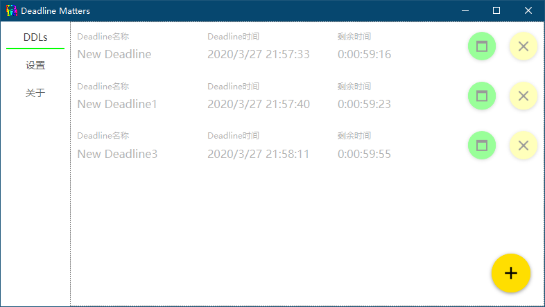

# DDLMwin
Deadline Matters for Windows

## 目录
[更新](#更新)  
[开发背景](#开发背景)  
[使用](#使用)  
[截图](#截图)  
[性能](#性能)  
[其他](#其他)  

## 更新
v1.0.3(2020-3-28)  
解决了开机无法启动DDLM的问题  

v1.0.2(2020-3-27)  
解决了有浮窗的Deadline删除后程序闪退的问题  

v1.0.1(2020-3-27)  
解决了打开设置页面后Deadline页面无法刷新的问题  
解决了设置页面背景的问题  
解决了设置无法保存的问题  

v1.0(2020-3-27)  
基本能用

## 开发背景
Windows没找到合适的Deadline倒计时软件，就自己瞎搞一个  
删除了安卓版（最后有提）的登录和分类功能  
软件开发基于[sqlite-net](https://github.com/praeclarum/sqlite-net "SQLite数据库管理")和
[MaterialDesignInXamlToolkit](https://github.com/MaterialDesignInXAML/MaterialDesignInXamlToolkit "WPF的Material Design库")

## 使用
在[release页面](https://github.com/huangxinye99/DDLMwin/releases)直接下载zip压缩包  
解压后直接双击文件夹的exe文件即可  

  在主页点击Deadline对其进行设置  
  浮窗按钮创建此Deadline浮窗  
  删除按钮删除此Deadline  
  添加按钮新建Deadline
  
Deadline浮窗鼠标左键移动，右键设置Deadline，滚轮调整大小，双击关闭浮窗

设置页面可以设置DDLM的开机自启（需管理员身份）、主题颜色和提醒方式
支持闹铃提醒，使用了MediaPlayer所以基本的音频格式应该都支持  

以上说的所有功能都没有快捷键，**以后也不一定有**

## 截图
DDLM主程序  

Deadline浮窗  

## 性能
DDLm for Windows使用C#开发  
这是我第一款开发的WPF软件，会比其他的小应用吃内存  
但是60M在我个人接受范围内所以**以后也不会优化**  

## 其他
其实还有一个和同学开发的DDLM for Android，但是项目隐藏了，这里就不贴URL了。  
本质自嗨软件+Unity C#学习的副产物，所以以后也不会有怎么更改  
但如果有什么重大Bug还是会修的  
不知道用什么作为闹铃的话可以考虑压缩包中的sound.mp3
