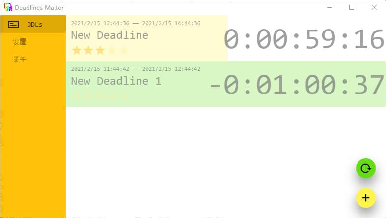

# DDLMwin
Deadline Matters for Windows

## 目录
[更新](#更新)  
[使用](#使用)  
[截图](#截图)  
[性能](#性能)  
[其他](#其他)  

## 更新  
v2.0(2021-2-15)  
添加了DDL重复 通知 提醒功能  
改进了界面  
添加了软件设置  

v1.2.2(2020-5-1)    
解决了最近一条Deadlne的显示Bug  

v1.2.1(2020-5-1)  
解决了逾期算法的Bug  

v1.2(2020-4-14)  
现在可以显示最近的一条Deadline   
浮窗支持显示器的边缘吸附  
关闭了浮窗的Aero Snap

v1.1.1（2020-4-7）  
解决了关机无法保存浮窗的问题  
解决了在应用主页修改DDL名称浮窗未改动的问题  

v1.1(2020-3-30)  
现在可以保存浮窗的位置和大小  

v1.0.3(2020-3-28)  
解决了开机无法启动DDLM的问题  

v1.0.2(2020-3-27)  
解决了有浮窗的Deadline删除后程序闪退的问题  

v1.0.1(2020-3-27)  
解决了打开设置页面后Deadline页面无法刷新的问题  
解决了设置页面背景的问题  
解决了设置无法保存的问题  

v1.0(2020-3-27)  
基本能用

## 使用
在[release页面](https://github.com/huangxinye99/DDLMwin/releases)直接下载zip压缩包  
解压后直接双击文件夹的exe文件即可  

具体使用方法软件里有

## 截图
DDLM主程序  

Deadline浮窗  

## 性能
DDLm for Windows使用C#开发  
内存占用在我个人接受范围内所以**以后也不会优化**  

## 其他
自嗨开发+Unity C#学习的副产物，以后也不会有什么大更改  
